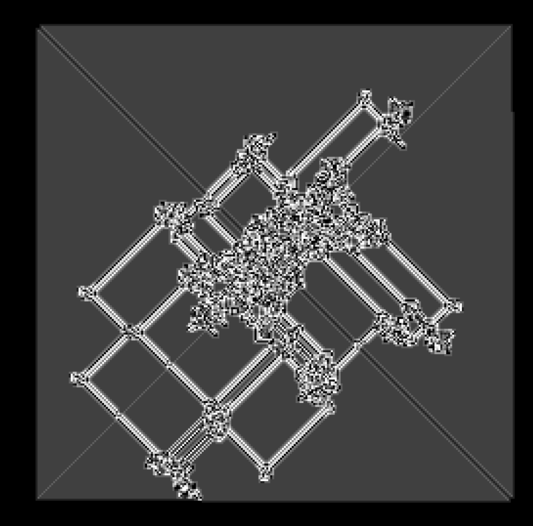

---

Langton's Ant

A browser simulation of Langton's Ant. An ant moves around a grid, turning left
or right based on the color of the cell it's on, then flips the cell's color.
Simple rules, complex patterns.

You can define custom rule strings (e.g. LRRL) to change the behavior, adjust
speed, and toggle between greyscale and color.

---

